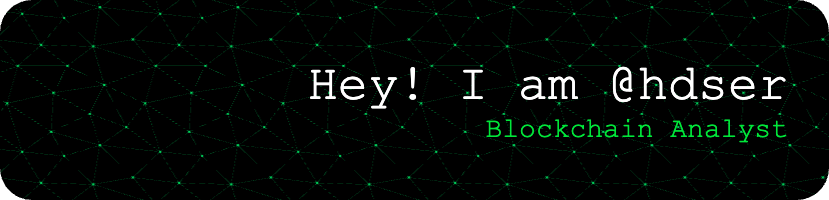

> **Blockchain Analyst** focused on **on-chain activity** and **data infrastructure**. My work spans projects like **Dune Analytics** [dashboards](your-dune-dashboard-link), data ingestion, database infra, and graph algorithms.

---

&nbsp;
&nbsp;

&nbsp;
&nbsp;
&nbsp;
&nbsp;
&nbsp;
&nbsp;
&nbsp;
&nbsp;
&nbsp;

|  |  |
| ------------- | ------------- |

<!---
hdser/hdser is a ✨ special ✨ repository because its `README.md` (this file) appears on your GitHub profile.
--->
